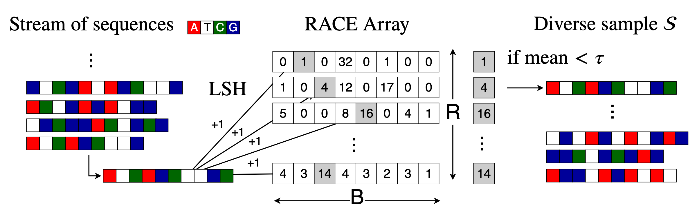

# DiversitySampling


## Introduction
This repository implements a one-pass diversity sampling algorithm for DNA sequences. If you give this tool a stream of sequences or a fastq/fasta file, it will save a diverse subset of them. Sequences are saved based on their distance from sequences that are already represented in the sample. It would be very slow to explicitly calculate these distances, so we use locality-sensitive hashing (LSH) to implement the fast algorithm described in our paper. 

This is interesting if you want to quickly estimate the biodiversity of a metagenomic sample. Since different organisms often have sufficiently different sequences, our tool can ensure that each organism is represented using only a few reads. In some cases, the data reduction can be quite dramatic - in one of our experiments, RACE only needed 5% of the reads to identify 95% of the species that were present. RACE is particularly good at finding species that occur very rarely since there is a very high probability that RACE will keep an unusual or unique sequence. Most other methods cannot make this guarantee without returning very large samples. 

We tested RACE on human microbiome metagenomics data, but the tool should also work well for downsampling from other categories of labeled genetic sequences (The labels could be chromosomes, genera, classes of bacteria, etc), provided the sequences in each category are different enough. In a nutshell, our method attempts to save a set of sequences that maximizes genetic diversity. 

## Installation
The algorithm is implemented as a command line tool written in C++. It takes in a fasta or fastq file, downsamples the file using the RACE method, and outputs a fasta or fastq file of diverse sequences. To compile the tool, clone the repo and 
```
make binaries
```
The Makefile should produce build and bin directories and output the executable file samplerace to bin/. This should work fine on most Linux systems. If something goes wrong, it is probably because your C++ compiler does not support C++11 or OpenMP. In particular, on MacOS the g++ command aliases to an outdated version of clang that does not support the -fopenmp flag. Windows does not include g++ by default, so you will need to install a compiler with OpenMP and C++11 support. 

## Algorithm and Hyperparameters
We use the RACE data structure, which is an efficient way to estimate kernel densities on streaming data. RACE is a small 2D array of integer counters indexed by a LSH function. These counters can tell whether we have already seen data that is similar to a new sequence. The key idea is that we only store sequences if we haven't seen something similar before. This gives us a diverse sample. 

### Algorithm 
RACE consists of an array of integer counters. These counters 





There are a couple of hyperparameters that you may want to change: 

- tau: This is a threshold for whether we should keep a new sequence or not. Increasing tau means that we will keep more sequences. Typical values for tau are between 0.1 and 100.0, depending on the size of the sample you wish to retain.
- range: This is the width of the RACE array. If there are many categories or organisms that you want to sample from, increasing range might help you get more diverse results. Increasing the range is essentially free, but keeping it below 10000 may lead to faster processing times. 
- reps: This is the depth of the RACE array. Increasing the reps will directly increase the time needed to process each input sequence, but you will be much less likely to accidentally discard a rare sequence. Typical values for reps are between 10 and 1000. 
- hashes: This is the number of LSH functions we use for each row of the RACE array. Increasing this will directly increase the processing time but may also let you differentiate between sequences that are closer together in terms of edit distance. We recommend using only 1 hash. 
- k: This is the size of each k-mer that is fed to the LSH function (MinHash). Increasing k means that we can differentiate between more similar sequences. To differentiate between species in metagenomic studies, we found that k = 16 is a good choice. If you want to differentiate between mutations or organisms within the same species, try a larger value of k. 

### Troubleshooting
If it seems like RACE isn't returning very good samples, try increasing k and increase the range. If RACE isn't returning enough samples, try increasing tau. If RACE is returning too many samples and you have already tried reducing tau, increase the reps. A more in-depth explanation of the algorithm is available in our paper. Feel free to contact the authors with any questions.

## How to run

Once you have the binaries compiled, you can run the algorithm on a test fastq file included with this repository by running 
```
bin/samplerace 0.1 SE data/SRR1056036.fastq data/output.fastq
```
RACE will only require about 20 KB of RAM (in constrast to the > 10 GB needed by other diversity sampling methods such as Diginorm, coresets and buffer-based methods) and it can process about 2.5 Mbp/s on a 2016 MacBook. To start, try tau = 1.0 and use the default parameter settings - they usually work pretty well. 
```
samplerace <tau> <format> <input> <output> [--range race_range] [--reps race_reps] [--hashes n_minhashes] [-k kmer_size]
Positional arguments: 
tau: floating point RACE sampling threshold. Roughly determines how many samples you will store. You may specify this in scientific notation (i.e. 10e-6)
format: Either PE, SE, or I for paired-end, single-end, and interleaved paired reads
input: path to input data file (.fastq or .fasta extension). For PE format, specify two files.
output: path to output sample file (same extension as input). For PE format, specify two files.
Optional arguments: 
[--range race_range]: (Optional, default 10000) Hash range for each ACE (B)
[--reps race_reps]: (Optional, default 10) Number of ACE repetitions (R)
[--hashes n_minhashes]: (Optional, default 1) Number of MinHashes for each ACE (n)
[--k kmer_size]: (Optional, default 16) Size of each MinHash k-mer (k)

Example usage:
samplerace 15.0 PE data/input-1.fastq data/input-2.fastq data/output-1.fastq data/output-2.fastq --range 100 --reps 50 --hashes 3 --k 5
samplerace 10e-6 SE data/input.fastq data/output.fastq --range 100 --reps 5 --hashes 1 --k 33
samplerace 0.1 SE data/input.fasta data/output.fasta --range 100000 --k 20
```

We support fasta and fastq formats. For fastq files, the RACE tool supports single-end, paired-end and interleaved paired reads. RACE will decide how to parse your files based on the file extension, so be sure to input files with either the .fastq or .fasta extension. 

### Single-End Reads

You can process single-end reads using the "SE" flag. In this case, RACE needs one input file and will write one output file.

### Paired-End Reads

Process paired-end read files using the "PE" flag. In this case, RACE needs two input files and will write two output files. We require that the two input files be synchronized. That is, files 1 and 2 should contain the same number of reads in the same order. If this isn't the case, you can use [fastq-pair](https://github.com/linsalrob/fastq-pair) to produce files that RACE can read. Also, note that RACE only uses the sequences from the first paired-end read file when deciding whether to keep a read. 

### Interleaved Reads
If your reads are interleaved (i.e. the file alternately lists the forward and backward reads), then you can specify the "I" flag. RACE will decide whether to keep each pair of sequences based on the the first sequence. You only need to specify one input file and one output file. 

## Contact 
For questions about installing or using this software, fill out an issue on GitHub and we'll do our best to help. For questions about the RACE algorithm, contact Benjamin Coleman at Rice University. If you use this software, please cite our paper. 


